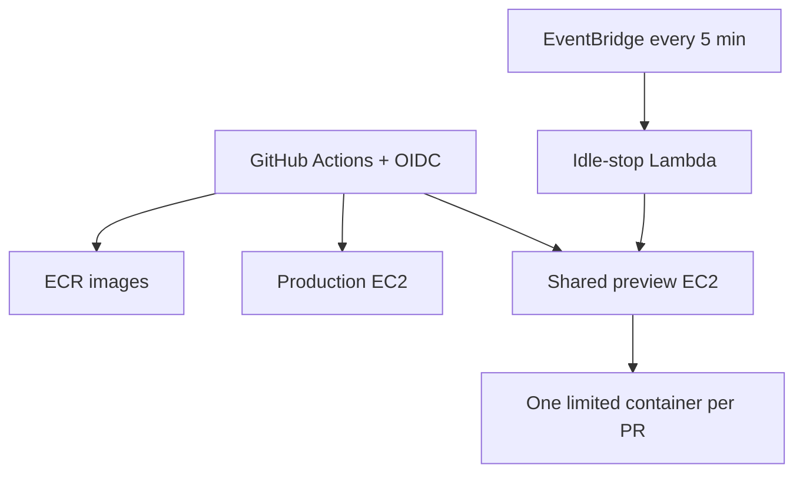

# AWS deployment setup and operations

This runbook provisions the proposed Keep & Lease production and shared PR-preview
hosts. It is an infrastructure foundation, not the server-computation migration
itself: the HTTP job API, authentication, Docker image, reverse-proxy configuration,
and GitHub deployment workflows must be implemented before public production use.

## Resulting topology



Both hosts are ARM64 Amazon Linux 2023 instances by default, with encrypted gp3
volumes and Docker. Only HTTP/HTTPS are exposed. Administration and deployments use
AWS Systems Manager, so port 22 and SSH keys are unnecessary. Production has an
Elastic IP. A preview Elastic IP is optional because retaining it while stopped is
billable.

## Credentials and prerequisites

Install AWS CLI v2, Terraform 1.7+, Git, and Docker locally. Create or select an AWS
account and enable MFA on its root user. For initial setup, configure a **named AWS
CLI profile** belonging to an administrator or dedicated infrastructure-bootstrap
role:

```bash
aws configure sso --profile keep-lease-admin
aws --profile keep-lease-admin sts get-caller-identity
```

AWS IAM Identity Center/SSO is preferred. If temporary access keys must be used,
keep them only in the local AWS credential store; never pass them as script
arguments, commit them, put them in `terraform.tfvars`, or store them as GitHub
secrets. The administrator permission is needed only to bootstrap/update
infrastructure. GitHub deployments subsequently receive short-lived AWS credentials
through the repository-scoped OIDC role.

## 1. Prepare Terraform state

From the repository root:

```bash
./scripts/aws/bootstrap-state.sh --profile keep-lease-admin --region eu-west-1
```

The script discovers the account number and idempotently creates a unique S3 bucket
with versioning, encryption, public access blocking, and native Terraform state
locking. It writes the untracked `infra/aws/backend.hcl`. Losing Terraform state can
make safe updates difficult; restrict bucket access and retain versioning.

## 2. Configure and inspect the infrastructure

```bash
cp infra/aws/terraform.tfvars.example infra/aws/terraform.tfvars
```

Set `github_owner`, repository, instance types, idle interval, and whether the
preview Elastic IP is retained. The default `t4g.small` choice is provisional;
benchmark the completed server engine before production. If a dependency lacks
ARM64 support, change the AMI selection and instance types together before apply.

Generate and inspect a plan:

```bash
./scripts/aws/infrastructure.sh plan --profile keep-lease-admin --region eu-west-1
terraform -chdir=infra/aws show tfplan
```

Review every resource and the estimated costs in AWS Pricing Calculator. In
particular, confirm that no NAT Gateway or load balancer was added inadvertently.

## 3. Create the resources

```bash
./scripts/aws/infrastructure.sh apply --profile keep-lease-admin --region eu-west-1
terraform -chdir=infra/aws output
```

The configuration creates:

- a VPC, public subnet, route, and security group;
- production and preview EC2 instances with encrypted disks and IMDSv2;
- an instance role for Systems Manager, ECR reads, and preview activity updates;
- separate production and preview ECR repositories;
- GitHub's OIDC provider plus separate master-only production and PR-only preview roles;
- an SSM activity parameter;
- a five-minute EventBridge check and Lambda idle-stop function;
- a fixed production IP and optionally a fixed preview IP.

Apply is repeatable. Terraform will show changes before making them. Do not run
`destroy` casually; the wrapper requires an explicit project-name confirmation.

## 4. Verify host access and bootstrap

Wait until the instances appear as managed nodes in Systems Manager, then use:

```bash
aws --profile keep-lease-admin --region eu-west-1 ssm start-session \
  --target "$(terraform -chdir=infra/aws output -raw production_instance_id)"
```

Verify Docker, disk space, outbound access, SSM Agent, and architecture. Do not open
SSH. Add the production reverse proxy, TLS certificate, application authentication,
and health check before making the endpoint public. DNS may be Route 53 or another
provider; this Terraform deliberately does not assume ownership of a domain.

## 5. Connect GitHub Actions without stored AWS keys

Add the Terraform outputs `github_production_role_arn` and
`github_preview_role_arn` as distinct repository/environment variables, plus
`AWS_REGION`, instance IDs, and ECR URLs. Workflows require:

```yaml
permissions:
  id-token: write
  contents: read
```

They then use `aws-actions/configure-aws-credentials` with the relevant role ARN.
The production role trusts only `master` and can push/deploy only production. The
preview role trusts the `pull_request` subject and can start/deploy only preview.
Also protect `master`, require production-environment approval, and ensure untrusted
fork PR code cannot obtain a privileged deployment token without approval.

## 6. Container deployment lifecycle

The application still needs a Dockerfile and server API. Once present, workflows
should:

1. build and test an immutable image tagged with the commit SHA;
2. authenticate to ECR using OIDC and push the image;
3. start the preview instance when necessary and wait for EC2/SSM readiness;
4. send an SSM command that pulls the exact digest and starts/replaces the container;
5. apply CPU, memory, process, timeout, and disk limits;
6. report version, commit, image digest, and URL on the PR;
7. run a health check and roll back if it fails.

The repository includes `scripts/aws/start-instance.sh` and
`scripts/aws/deploy-container.sh` as low-level building blocks for steps 3–4. The
deploy script validates identifiers, uses SSM, pulls an immutable ECR reference,
binds the application only to loopback for a reverse proxy, and imposes baseline
container limits. A workflow must still supply the tested image, configure the
proxy/TLS route, update activity, and perform health/rollback handling.

Production should use a single approved image digest, not rebuild after approval.
Preview containers should be named by PR number and removed when the PR closes.

## 7. Automatic preview shutdown

The host or application records activity by calling:

```bash
PREVIEW_ACTIVITY_PARAMETER=/keep-and-lease/preview/activity \
  ./scripts/aws/preview-activity.sh ACTIVE_JOB_COUNT
```

Call it on deployment, HTTP activity (rate-limited), job enqueue/start/finish, and
container removal. The value is `last_activity_epoch:active_job_count`. Every five
minutes Lambda stops the preview instance only when it is running, no jobs are
active, and the timestamp is older than `preview_idle_minutes`.

This cooperative counter needs reconciliation after crashes. The application should
derive the active count from its durable job store periodically rather than blindly
increment/decrement it. CloudWatch alarms should report a stale nonzero count. A new
PR deployment can wake the server with `StartInstances`; a reviewer request cannot
reach a fully stopped server, so optional browser-triggered waking requires a small
always-on API Gateway/Lambda endpoint with authentication and rate limits.

Production is intentionally not auto-stopped. Stopping it would make the normal URL
unavailable and invalidate in-memory jobs/caches.

## 8. Security and operational checklist

- Require HTTPS and login; public reachability is not authorization.
- Keep preview/production GitHub roles separate and regularly tighten least privilege.
- Store application secrets in Secrets Manager or Parameter Store, not images or
  repository variables; grant only the relevant instance role access.
- Encrypt result storage and logs; define retention and backup policies.
- Validate parameters and enforce per-user concurrency, runtime, output-size, and
  request-rate limits.
- Run containers as a non-root user with a read-only filesystem where possible.
- Add CloudWatch alarms for CPU, memory (agent required), disk, 5xx rate, job failure,
  queue age, Lambda errors, and unexpected spend.
- Configure AWS Budgets and cost-anomaly alerts before load testing.
- Patch base images and scan ECR images; redeploy instead of modifying hosts by hand.
- Test state recovery, instance replacement, job cancellation, and rollback.

## 9. Teardown

First export any required logs/results and remove DNS. Then run a plan and only if
the exact account and project are confirmed:

```bash
./scripts/aws/infrastructure.sh destroy --profile keep-lease-admin --region eu-west-1
```

The state bucket is deliberately not destroyed by Terraform. Empty/delete it only
after confirming the infrastructure is gone and no recovery is needed.

## What is automated and what remains

| Automated here | Additional application/deployment work |
|---|---|
| State, VPC, EC2, ECR, IAM/SSM, OIDC | Server-side asynchronous backtest API |
| Production/preview hosts | Dockerfile and non-root runtime image |
| Preview idle-stop scheduler | Durable job/activity store and reconciliation |
| Base deployment permissions | GitHub build/deploy/close-PR workflows |
| Encrypted disks and no SSH ingress | HTTPS, DNS, login, secrets, monitoring |

## Official references

- [AWS IAM OIDC federation](https://docs.aws.amazon.com/IAM/latest/UserGuide/id_roles_providers_oidc.html)
- [Systems Manager Session Manager](https://docs.aws.amazon.com/systems-manager/latest/userguide/session-manager.html)
- [EC2 stop/start behavior](https://docs.aws.amazon.com/AWSEC2/latest/UserGuide/Stop_Start.html)
- [EventBridge Scheduler](https://docs.aws.amazon.com/eventbridge/latest/userguide/using-eventbridge-scheduler.html)
- [EC2 security groups](https://docs.aws.amazon.com/AWSEC2/latest/UserGuide/ec2-security-groups.html)
