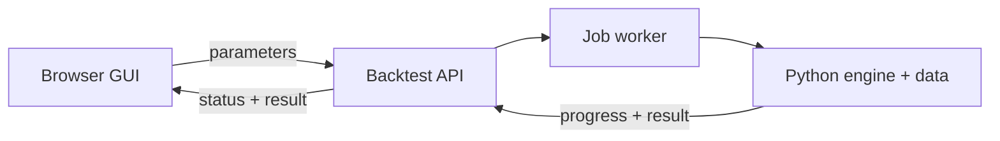
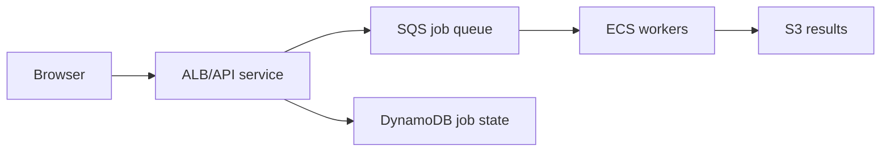

# Deployment and calculation architecture

## Current implementation pointer

The single updatable pointer is [CURRENT_WORK.md](CURRENT_WORK.md). It identifies
the current unmerged branch, pull request, version, completion scope, and explicitly
deferred work. Update that file whenever active development moves; do not copy a
change-specific PR number throughout the documentation.

The exact deployed revision must still be verified from `Version … · commit …` in
the GUI, which is generated from `VERSION` and the deployment commit at build time.
A commit SHA recorded in prose is only a historical snapshot.

## Current dual-computation design

The GUI now loads `backtest-worker-v13.js`, which keeps the existing worker message
contract. It uses the configured server API when healthy and otherwise starts the
unchanged v12 Pyodide worker in a nested worker. `?engine=server` requires the API;
`?engine=pyodide` explicitly selects browser computation; `?engine=auto` is the
default server-first behavior.

The Pyodide runtime, Python sources, historical data, progress reporting, run
operation, and day-inspection operation remain packaged exactly as before. They
will remain available until server equivalence and operational reliability are
accepted.

## Fixed two-service Render preview

The first server-computation deployment target is one persistent Render GUI and
one persistent Render API. Both use stable public URLs and have automatic deploys
disabled. `.github/workflows/deploy-fixed-render-preview.yml` passes the same Git
commit to both secret deploy hooks, waits until the API health and GUI build
metadata report that exact commit, and verifies that the generated GUI computation
configuration points to the fixed API URL.

`render.preview.yaml` recreates the two services. The required Render and GitHub
operator setup, secret names, URL variables, diagnostics, and recovery procedure
are maintained in [RENDER_FIXED_PREVIEW.md](RENDER_FIXED_PREVIEW.md). This shared
preview is last-deployment-wins; it is not an isolated per-PR environment.

## Implemented browser-to-server computation foundation

The normal calculation path will move Python and historical data to the application
server. The browser will retain the GUI and plotting code and exchange JSON with a
versioned HTTP API.

Here, **server-side CPython** means ordinary execution of the repository's `.py`
files by the standard Python interpreter installed on the server. CPython is the
usual implementation people mean when they say “Python.” It is named explicitly
only to contrast it with Pyodide, which ports the CPython interpreter to
WebAssembly for execution inside a browser. Deployment does not compile the
strategy files into a separate native application: the server starts Python,
imports the same modules, and Python compiles imported source to bytecode as usual.

### API contract

1. `POST /api/v1/backtests` validates a versioned parameter document and returns a job ID.
2. `GET /api/v1/backtests/{job_id}` returns queued/running/completed/failed status,
   calculation stage, elapsed time, and structured log messages.
3. `GET /api/v1/backtests/{job_id}/result` returns the canonical result object
   unchanged, including plotting, statistics, and decomposition fields.
4. `DELETE /api/v1/backtests/{job_id}` requests cancellation when supported.
5. A canonical hash of engine version, data-manifest version, and parameters may
   reuse an identical cached result.
6. `POST /api/v1/inspections` returns the existing inspected-day market and score
   audit for a date and the same parameter document.

Job status records application version, engine commit, data-manifest hash,
parameters, timestamps, calculation duration, progress logs, and result size. The
server rejects unsupported schema versions and imposes parameter/result-size and
concurrency bounds. Date-range and runtime limits remain to be added after initial
measurements.

### Server lifecycle

- The initial service loads Python modules immediately and market objects lazily on
  the first run, then retains them for later jobs.
- Retain constructed market objects across jobs.
- Backtests run in a one-thread in-process queue outside the HTTP request lifecycle,
  so proxy/request timeouts do not terminate calculations.
- Concurrent calculations are limited to one per server; later jobs queue.
- Stream or poll progress independently of the final result.
- Pyodide remains an explicitly selectable and automatic startup fallback.

### Migration sequence

1. Extract a stable JSON request/result boundary around the existing canonical
   Python engine without changing formulas.
2. Add a server-side job runner and progress store.
3. Run the same fixtures in Pyodide and CPython and require equivalent results.
4. Switch the GUI default to the API while retaining the browser fallback.
5. Measure duration, peak resident memory, result size, cache hit rate, and cold
   start time with silver-only and full multi-commodity runs.
6. Remove the browser calculation path only after the server path is operationally
   reliable.

## Google Cloud Run scale-to-zero implementation

The Google Cloud implementation and first-deployment runbook are specified in
[GOOGLE_CLOUD_RUN_SETUP.md](GOOGLE_CLOUD_RUN_SETUP.md). It separates the
scale-to-zero GUI/API service from durable, independently sized Cloud Run Job
executions. Versioned Parquet market data and compressed results live in Cloud
Storage in the target data design; compressed results and durable job metadata are
implemented now, while the Parquet input migration remains pending.

This design is especially suitable for intermittent use because no worker remains
allocated between calculations and an incoming request automatically wakes the web
service. It requires an application change: a Cloud Run service must not depend on
a background thread continuing after the submission request returns. The web
service instead creates a durable record and invokes a Job.

The cloud job/result adapters, one-shot worker, separate containers, Cloud Run v2
Terraform, immutable-digest OIDC deployment, cancellation, heartbeats, stale-lease
reconciliation, compressed result streaming, checksums, timing, and peak-RSS
measurement are implemented. The durable foundation is provisioned; the private
Cloud Run service and Job are deployed and their authenticated health check passes.
The bounded numerical smoke test remains.

The initial worker is 1 vCPU and 4 GiB, with one task, a 30-minute timeout and zero
automatic retries. The current worker image intentionally bundles the small
calculation-ready ZIP/CSV set for the first equivalence test. Versioned
Parquet/DuckDB/Arrow access through the market-data bucket remains the next data
phase. The Cloud Run web service does not load histories; synchronous day inspection
therefore remains deferred.

## AWS production and PR-preview option

The executable infrastructure foundation and operator runbook are in
[`infra/aws`](../infra/aws/README.md) and [AWS_SETUP.md](AWS_SETUP.md). They use
Terraform plus small plan/apply/activity scripts, an AWS CLI profile only for
initial administration, and GitHub OIDC for later short-lived deployment
credentials.

Two Amazon EC2 instances can support this project:

| Instance | Purpose | Recommended availability |
|---|---|---|
| Production | Stable GUI/API and production backtests | Provisioned but stopped for now; normally always running after launch |
| Preview | Shared host for a small number of PR deployments | Start on demand; stop automatically after inactivity |

The preview instance can run one isolated container per open PR. A reverse proxy
such as Caddy or nginx routes `pr-22.preview.example.com` to that PR's container.
Each container must have explicit CPU, memory, process, and runtime limits so one
preview cannot exhaust the shared host. Closing a PR removes its container and
working files; repository data should be read-only or separately cached.

### Preview lifecycle

1. A GitHub Actions workflow on PR open/update calls AWS using short-lived OIDC
   credentials, starts the preview EC2 instance if necessary, and waits for its
   status checks.
2. The workflow deploys or replaces that PR's container and posts the preview URL,
   application version, and commit to the PR.
3. The host records deployment, request, and backtest-job activity.
4. An EventBridge schedule invokes Lambda periodically. It stops the instance only
   when there are no running jobs/deployments and the latest activity is older than
   the configured idle interval.
5. A new PR deployment starts the instance again. Optionally, a small always-on
   API Gateway/Lambda wake endpoint can start it for a reviewer and return a
   "starting" page; a fully stopped EC2 instance cannot receive its own wake-up
   HTTP request.

Use an Elastic IP or stable DNS update during start-up if a stable preview hostname
is required. HTTPS certificates and DNS must remain usable across stop/start.

### Billing behavior and caveats

- Linux EC2 On-Demand compute is charged per second with a 60-second minimum and
  stops accruing instance-usage charges when the instance is stopped.
- Attached EBS volumes continue to incur storage charges while an instance is
  stopped. Public IPv4 addresses, snapshots, data transfer, DNS, logs, and any
  always-on gateway/Lambda resources may also incur charges.
- Stopping production after inactivity is possible, but it makes the public service
  unavailable until an external component starts it. For production, an always-on
  small instance or a serverless/container service with scale-to-zero behavior is
  usually operationally cleaner.
- Lightsail is simpler but is less suitable for the requested pay-only-while-running
  behavior: stopped-instance charges and bundled pricing differ from EC2.

### Indicative fixed-cost estimate

The following planning estimate is in USD, before tax, dated 2026-08-03. Actual
regional prices must be confirmed in the AWS Pricing Calculator before deployment.
It assumes two 20 GB gp3 root volumes, one Route 53 hosted zone, and no load balancer,
NAT Gateway, managed database, or paid support plan.

| Resource retained all month | Approximate monthly cost |
|---|---:|
| Two 20 GB gp3 volumes at a representative $0.08/GB-month | $3.20 |
| Route 53 hosted zone | $0.50 plus negligible low-volume queries |
| One public IPv4 address for always-on production | $3.65 |
| Preview public IPv4 retained even while stopped | additional $3.65 |
| **Fixed infrastructure subtotal** | **about $7.35 with a released/dynamic preview IP, or $11.00 with two retained IPv4 addresses** |

The domain registration, snapshots, stored logs, and outbound data are additional.
Small usage of Lambda/EventBridge for start/stop automation should normally be
minor, but it is usage-priced rather than guaranteed to be zero.

Production compute is technically usage-based, but an always-running instance acts
like a fixed monthly cost. A small ARM burstable instance is roughly in the
`$12–30/month` range depending on memory size and region; therefore a practical
two-server baseline is approximately **$20–40/month before preview run time**, with
preview compute added only for the hours it is running. This is a capacity-planning
range, not a quotation. Select the instance only after measuring peak memory and CPU
time; use x86 instances instead if any Python dependency lacks ARM64 support.

Official references:

- [EC2 On-Demand pricing and billing](https://aws.amazon.com/ec2/pricing/on-demand/)
- [Amazon EBS pricing](https://aws.amazon.com/ebs/pricing/)
- [Amazon VPC public IPv4 pricing](https://aws.amazon.com/vpc/pricing/)
- [Amazon Route 53 pricing](https://aws.amazon.com/route53/pricing/)
- [Starting and stopping EC2 instances](https://docs.aws.amazon.com/cli/latest/reference/ec2/stop-instances.html)
- [AWS resource scheduling guidance](https://docs.aws.amazon.com/solutions/latest/instance-scheduler-on-aws/solution-overview.html)
- [GitHub Actions OIDC with AWS](https://docs.github.com/en/actions/how-tos/secure-your-work/security-harden-deployments/oidc-in-aws)

## Hosting decision checkpoint

Implement the server API so it is platform-neutral. First benchmark it with the
current deployment environment. Choose Render, EC2, or another runtime only after
recording warm and cold timings, peak memory, expected simultaneous users, and the
acceptable preview/production wake-up delay.

## Scale-out alternative: managed containers and queue

If usage grows beyond a few concurrent calculations, do not scale the two mutable
EC2 hosts by adding more PR containers manually. Keep the same versioned HTTP API
but move to this managed topology:

- Run the stateless GUI/API as an ECS service behind an Application Load Balancer.
- Put validated jobs on SQS and scale independent ECS/Fargate workers from queue
  depth and age.
- Store status/idempotency/leases in DynamoDB (or a managed relational database)
  and large immutable results in S3 with lifecycle expiry.
- Put images in ECR and deploy immutable task definitions per environment.
- Give each PR an isolated service/task definition, or use a bounded preview pool;
  remove it on PR close.
- Add Cognito/OIDC authentication, WAF/rate limiting, centralized logs/traces,
  alarms, dead-letter queues, retries, cancellation, and per-user quotas.

Additional work compared with two EC2 hosts includes containerizing the API and
worker separately; making all job state durable; removing reliance on in-process
market caches or adding a versioned shared-data/cache strategy; defining safe
idempotent retry/lease semantics; building ECS/ALB/SQS/S3/DynamoDB infrastructure;
autoscaling/load testing; and implementing zero-downtime schema and task-definition
migrations. Fargate simplifies host operations but does not inherently scale to
zero for a continuously reachable API/ALB, and an ALB itself adds a standing cost.
For highly intermittent workloads, an alternative scalable variant is API Gateway
+ Lambda for the control plane and AWS Batch/ECS tasks for calculations, accepting
greater cold-start and orchestration complexity.
