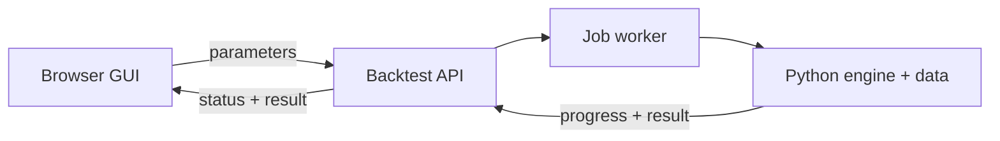

# Deployment and calculation architecture

## Current implementation pointer

The single updatable pointer is [CURRENT_WORK.md](CURRENT_WORK.md). It identifies
the current unmerged branch, pull request, version, completion scope, and explicitly
deferred work. Update that file whenever active development moves; do not copy a
change-specific PR number throughout the documentation.

The exact deployed revision must still be verified from `Version … · commit …` in
the GUI, which is generated from `VERSION` and the deployment commit at build time.
A commit SHA recorded in prose is only a historical snapshot.

## Authoritative deployment platform

**Google Cloud Run is the active deployment platform for Keep & Lease.** New
production deployments, branch previews, phone/browser previews, and deployment
troubleshooting must use the Google Cloud infrastructure described in
[GOOGLE_CLOUD_RUN_SETUP.md](GOOGLE_CLOUD_RUN_SETUP.md) and the GitHub Actions
workflow `.github/workflows/deploy-google-cloud.yml`.

Render was used during an earlier server-preview phase, but that workflow has been
discarded. Existing Render manifests, workflows, documentation, services, URLs,
and deploy hooks are legacy artifacts only and must not be used as the current
preview or production path. AWS material below is retained as historical/design
comparison rather than the selected deployment architecture.

## Current dual-computation design

The GUI now loads `backtest-worker-v13.js`, which keeps the existing worker message
contract. It uses the configured server API when healthy and otherwise starts the
unchanged v12 Pyodide worker in a nested worker. `?engine=server` requires the API;
`?engine=pyodide` explicitly selects browser computation; `?engine=auto` is the
default server-first behavior.

The Pyodide runtime, Python sources, historical data, progress reporting, run
operation, and day-inspection operation remain packaged exactly as before. They
will remain available until server equivalence and operational reliability are
accepted.

## Legacy Render preview — retired

The repository contains historical `render.preview.yaml`, Render documentation,
and Render workflow files from the first server-computation preview. They are
retained only for provenance/cleanup and do not define the current deployment.
Do not provision a Render service when asked to preview a current branch. Use the
Google Cloud workflow and access procedure instead.

## Implemented browser-to-server computation foundation

The normal calculation path moves Python and historical data to the application
server. The browser retains the GUI and plotting code and exchanges JSON with a
versioned HTTP API.

### API contract

1. `POST /api/v1/backtests` validates a versioned parameter document and returns a job ID.
2. `GET /api/v1/backtests/{job_id}` returns queued/running/completed/failed status,
   calculation stage, elapsed time, and structured log messages.
3. `GET /api/v1/backtests/{job_id}/result` returns the canonical result object.
4. `GET /api/v1/backtests/latest` returns metadata and the result URL for the most
   recently completed durable run owned by the current IAP identity, or `204` when
   none exists. New job status, result, and cancellation access uses the same owner.
5. `DELETE /api/v1/backtests/{job_id}` requests cancellation when supported.
6. A canonical hash of engine version, data-manifest version, and parameters may
   reuse an identical cached result.
7. `POST /api/v1/inspections` returns the existing inspected-day market and score audit.

## Google Cloud Run scale-to-zero implementation

The Google Cloud implementation and deployment runbook are specified in
[GOOGLE_CLOUD_RUN_SETUP.md](GOOGLE_CLOUD_RUN_SETUP.md). It separates the
scale-to-zero GUI/API service from durable, independently sized Cloud Run Job
executions. Compressed results and durable job metadata are implemented; market
input storage/cache optimization continues separately.

The cloud job/result adapters, one-shot worker, separate containers, Cloud Run v2
Terraform, immutable-digest OIDC deployment, cancellation, heartbeats, stale-lease
reconciliation, compressed result streaming, checksums, timing, and peak-RSS
measurement are implemented. The durable foundation is provisioned. The `stable`
target keeps the private working-version service and Job deployed from `master`;
the `preview` target keeps a separate private service, Job, Terraform state, and
Firestore job/cache namespace for feature-branch inspection.

The GitHub deployment workflow is `.github/workflows/deploy-google-cloud.yml`.
Stable deployment is automatic from `master`; pushes to `agent/**` automatically
deploy to the separate preview target. Manual workflow dispatch with the default
`preview` target supports other reviewed refs. Preview procedures identify the
exact branch/SHA and verify the GUI's displayed commit before merge.

Direct Cloud Run IAP is the planned normal browser access path limited to approved
Google identities. Truly anonymous access must wait until the public GUI is
separated from the private calculation API and application authentication, job
ownership, quotas, spending limits, and abuse controls are implemented. See
[GOOGLE_CLOUD_RUN_SETUP.md](GOOGLE_CLOUD_RUN_SETUP.md) for the current access state.

The initial worker is 1 vCPU and 4 GiB, with one task, a 30-minute timeout and zero
automatic retries. The Cloud Run web service does not load histories; synchronous
day inspection there remains deferred.

## Historical alternatives

AWS/EC2 and Render designs remain in repository history and supporting documents as
architecture comparisons. They are not the selected deployment target. Any future
change away from Google Cloud must be an explicit architecture decision accompanied
by an update to this document, README, and the deployment runbook.
