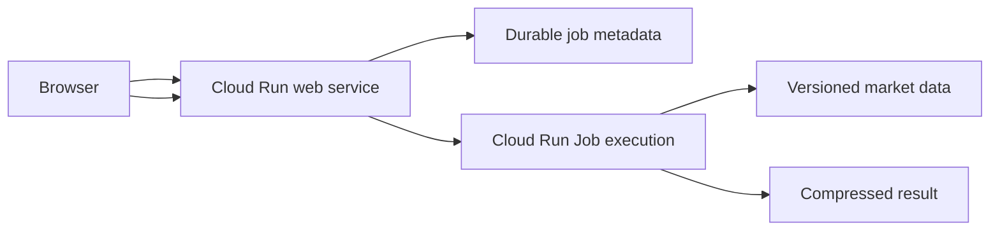

# Google Cloud Run deployment design

## Status and purpose

This document specifies a proposed Google Cloud deployment for Keep & Lease. It
does not claim that a Google Cloud project or any resources already exist. The
design targets intermittent use, automatic scale-to-zero, durable asynchronous
backtests, and reproducible market data. It preserves the versioned HTTP contract
described in [DEPLOYMENT_ARCHITECTURE.md](DEPLOYMENT_ARCHITECTURE.md).

Cloud Run is an alternative deployment implementation to the EC2 foundation in
[AWS_SETUP.md](AWS_SETUP.md). The strategy engine must remain platform-neutral.

## Decision summary

Use two independently scalable container workloads:

| Component | Cloud Run product | Initial resources | Purpose |
|---|---|---:|---|
| Web | Cloud Run service | 1 vCPU, 512 MiB–1 GiB | GUI, validation, submission, status, result access |
| Calculation | Cloud Run Job | 1 vCPU, 4 GiB | One durable backtest execution |
| Market/result storage | Cloud Storage | usage based | Versioned Parquet inputs and compressed results |
| Job metadata | Firestore or equivalent durable store | usage based | Job status, progress, hashes, ownership, result pointer |
| Images | Artifact Registry | usage based | Immutable web and worker images |
| Build/deploy | Cloud Build or GitHub Actions with OIDC | usage based | Tested deployments without stored cloud keys |

Set the web service minimum instance count to zero and initially cap both the web
service and calculation concurrency. No continuously running server is required.

## Why the calculation is a Cloud Run Job

The existing server starts a background Python thread, returns a job ID, and keeps
status and results in process memory. That is not a durable Cloud Run design:
request-based service CPU is associated with request processing, and an idle
service instance may be removed after a request completes.

The API must therefore create a durable job record and start a Cloud Run Job
execution. The worker updates durable status and writes its completed result
outside its container. Browser polling reaches the web service, not the worker.



A Job is preferable to holding one HTTP request open because it survives browser
disconnection, has explicit execution state, supports retries and timeouts, and
does not rely on the lifetime of a particular web-service container.

## API lifecycle

1. `POST /api/v1/backtests` validates the versioned parameter document.
2. The web service calculates an idempotency hash over parameter schema, engine
   image digest, and data-manifest hash.
3. An identical completed result may be returned from cache.
4. Otherwise the service creates a durable `queued` record and starts a Job
   execution with only the job identifier and immutable version identifiers.
5. The worker changes the record to `running`, publishes bounded progress, loads
   the selected data, and executes the canonical strategy.
6. The worker writes the compressed result to Cloud Storage and atomically changes
   the record to `completed` with result URI, size, checksum, timing, and peak RSS.
7. `GET /api/v1/backtests/{id}` returns durable status and progress.
8. `GET /api/v1/backtests/{id}/result` authorizes access and streams the stored
   result; it must not retain another full decoded copy unnecessarily.
9. Cancellation marks a job as cancellation-requested and calls the supported Job
   execution cancellation mechanism. The engine checks cancellation between safe
   calculation phases.

On container or platform failure, a claimed job must become `failed` or
`interrupted`, not remain `running` forever. Use heartbeats and a lease expiry.

## Market-data design

Retain raw source archives for audit, but do not use ZIP parsing as the normal
calculation path. A separate ingestion operation validates and converts source
data into an immutable, versioned analytical dataset.

Recommended tables:

- futures quotes: date, commodity, symbol, maturity, settlement, volume, source;
- spot quotes: date, commodity, price, source;
- interest rates: date, tenor, rate, source;
- corrections: series, date, raw value, interpreted value, reason;
- data manifest: version, source hashes, schema, ingestion commit, creation time.

Store canonical calculated-ready data as partitioned Parquet in Cloud Storage.
Use DuckDB to query required commodities, dates, and columns with filter and
projection pushdown. Convert query results to Arrow or NumPy arrays rather than
per-cell Python objects.

A conventional managed PostgreSQL service is not required for these predominantly
read-only analytical scans. It would add an always-on cost and would not reduce
memory if the worker immediately reconstructed the full dictionary model.

The first migration may keep the existing engine unchanged behind a market adapter.
The adapter must eliminate the duplicate silver market construction. Subsequent
work should stream date groups, retain compact numeric arrays, calculate comparison
aggregates without a second complete result, and generate detailed diagnostics only
for sampled or explicitly inspected dates.

## Storage layout and retention

Use separate buckets or prefixes for immutable input and mutable output:

```text
gs://<project>-market-data/
    raw/
    parquet/version=<manifest-hash>/
    manifests/<manifest-hash>.json

gs://<project>-results/
    jobs/<job-id>/result.json.gz
    jobs/<job-id>/diagnostics.parquet
```

Enable uniform bucket-level access, public-access prevention, encryption, object
versioning where recovery requires it, and lifecycle rules. Suggested initial
retention:

- raw inputs and published manifests: retain;
- published Parquet versions: retain current and reproducibility-required versions;
- successful calculation results: 90 days unless pinned;
- failed partial outputs: 7 days;
- old container images: retain recent and production-referenced digests.

Every result records the engine commit/image digest and exact data-manifest hash.

## Resource and concurrency configuration

Initial worker setting:

```text
CPU: 1 vCPU
Memory: 4 GiB
Task timeout: 30 minutes
Retries: 0 until the calculation is proven idempotent
Parallel tasks per execution: 1
Maximum simultaneous executions: 1 at application level
```

The current engine is largely single-threaded. Do not pay for additional vCPUs
until profiling demonstrates a benefit. Increase memory only after measuring peak
RSS with silver-only and full intended multi-commodity runs.

Initial web setting:

```text
CPU: 1 vCPU
Memory: 512 MiB or 1 GiB
Minimum instances: 0
Maximum instances: 1
Request-based billing
Request timeout: sufficient for submission/result streaming, not calculation
```

The web service must not load complete market histories.

## Indicative cost model

Pricing is usage-based and region-dependent. At the published base Cloud Run Job
rates used for planning, 1 vCPU plus 4 GiB costs approximately:

```text
CPU     1 × $0.000018 per second
Memory  4 × $0.000002 per second
Total       $0.000026 per active second
```

That is approximately $0.0039 for 2.5 minutes, $0.0078 for 5 minutes, and $0.0156
for 10 minutes before free-tier allowances. The published monthly Jobs free tier
includes 240,000 vCPU-seconds and 450,000 GiB-seconds. At 4 GiB, memory is the
binding allowance at about 31.25 job-hours, or roughly 375 five-minute jobs.

The web service, storage, image registry, builds, logs, metadata operations, and
network egress have separate allowances and prices. Before provisioning, calculate
the chosen region—Tel Aviv `me-west1` and a nearby European region are candidates—
in the Google Cloud Pricing Calculator. Configure a budget and alerts before load
testing. Treat all figures here as planning estimates, not quotations.

## Identity and security

Use distinct least-privilege service accounts:

### Web service identity

May:

- create/read/update job metadata;
- execute only the named calculation Job;
- read result metadata and result objects for authorized requests;
- read non-secret public configuration.

It must not administer arbitrary Cloud Run services, IAM, buckets, or projects.

### Calculation worker identity

May:

- read the published market-data prefixes and manifest;
- read/update only its job record;
- write only its job result prefix;
- emit logs and metrics.

It must not deploy code or create other jobs.

### Deployment identity

Use GitHub Actions OpenID Connect or Cloud Build identity federation rather than a
stored service-account JSON key. Restrict trust to the intended repository,
branches/environments, and deployment workflow. Production deployment should
require protected-environment approval.

Public reachability is not authorization. Before production use, add application
authentication, secure cookies, CSRF protection where applicable, parameter and
result-size limits, rate limits, and per-user job quotas. Do not expose a public
endpoint that anonymously creates billable jobs.

Store secrets in Secret Manager and mount or expose only the specific secret
versions required by each workload.

## Observability and recovery

Emit structured logs with job ID, execution ID, engine version, data version, stage,
duration, RSS, result size, and error class. Define metrics and alerts for:

- Job failures, timeouts, retries, and stale leases;
- worker peak memory above 80% of the configured limit;
- unexpected web or worker instance counts;
- result checksum/serialization failures;
- invalid or unavailable data manifests;
- excessive job creation or spend;
- storage lifecycle failures.

The GUI must distinguish network failure, worker failure, cancellation, timeout,
server revision mismatch, and missing/expired result. It must never reduce all
these states to `Failed to fetch`.

## Provisioning interfaces

The design must be reproducible through scripts. Supported implementation paths:

- Terraform for projects with stable infrastructure-as-code ownership;
- `gcloud` for bootstrap, inspection, and operator recovery;
- Cloud Run Admin and Jobs REST APIs;
- Google Cloud's official Cloud Run MCP server when connected.

Prefer Terraform for buckets, service accounts, IAM, registry, metadata database,
service, Job, budgets, and alert policies. Use immutable container digests for
deployments. Keep local variable files and credentials untracked.

Example bootstrap sequence, with identifiers supplied by the operator:

```bash
gcloud auth login
gcloud config set project PROJECT_ID
gcloud services enable \
  run.googleapis.com \
  cloudbuild.googleapis.com \
  artifactregistry.googleapis.com \
  storage.googleapis.com \
  firestore.googleapis.com \
  secretmanager.googleapis.com \
  iamcredentials.googleapis.com
```

An illustrative deployment shape is:

```bash
gcloud run deploy keep-and-lease-web \
  --source . \
  --region REGION \
  --cpu 1 \
  --memory 1Gi \
  --min-instances 0 \
  --max-instances 1

gcloud run jobs create keep-and-lease-backtest \
  --image REGION-docker.pkg.dev/PROJECT_ID/keep-and-lease/worker:COMMIT \
  --region REGION \
  --cpu 1 \
  --memory 4Gi \
  --task-timeout 30m \
  --max-retries 0
```

These are design examples, not a ready-to-run operator script. The implementation
must use explicit service accounts, bucket names, authentication, environment
configuration, immutable digests, and post-deployment verification.

## Deployment workflow

1. Test the Python engine and GUI.
2. Validate every source archive and generated Parquet manifest.
3. Build separate web and worker images tagged by commit.
4. Scan images and push them to Artifact Registry.
5. Deploy a revision referencing immutable digests.
6. Verify health reports application version, commit, and supported schema.
7. Submit a bounded smoke job.
8. Verify its status lifecycle, result checksum, numerical fixtures, memory, and
   duration.
9. Shift traffic only after validation; retain a known-good revision for rollback.
10. Record the exact deployed web revision, worker digest, and data manifest.

PR previews should use isolated service names or an explicitly shared preview
environment. They must not receive production secrets or permission to execute
unreviewed code with a privileged production identity.

## Implementation sequence

1. Add peak-RSS and stage timing instrumentation to the present server.
2. Remove duplicate market construction and avoid retaining comparison rows.
3. Add durable job/result interfaces independent of a particular cloud.
4. Split the container entry points into web and calculation worker.
5. Introduce versioned Parquet ingestion and DuckDB/Arrow market access.
6. Add Cloud Run/Terraform configuration and least-privilege identities.
7. Deploy a private proof of concept in one candidate region.
8. Benchmark cold start, data retrieval, calculation, serialization, result
   download, memory, and billed time.
9. Compare Tel Aviv and a European region for latency, availability, and price.
10. Add authentication, quotas, budgets, alerts, backups, and retention.
11. Validate stop-to-zero and repeat-run result caching.
12. Promote only after numerical equivalence with the canonical fixtures.

## Acceptance criteria

The Google Cloud deployment is acceptable only when:

- no idle worker or minimum web instance is required;
- a cold submission completes without manual wake-up;
- jobs and completed results survive container replacement;
- the full intended commodity set stays below 80% of configured memory;
- one known calculation matches canonical fixtures within documented tolerances;
- exact commit, image digest, data manifest, parameters, and result checksum are
  recoverable;
- invalid archives fail ingestion rather than silently removing markets;
- an interrupted job produces a durable actionable status;
- budget alerts, authentication, quotas, lifecycle rules, and rollback are tested.

## Teardown

Terraform should remove Cloud Run services/Jobs, identities, policies, alerts, and
temporary registries only after results are exported. Canonical raw data, published
manifests, required Parquet versions, audit logs, and Terraform state require an
explicit retention decision. Never make bucket deletion an implicit side effect of
ordinary application teardown.

## Official references

- [Cloud Run pricing](https://cloud.google.com/run/pricing)
- [Cloud Run memory limits](https://cloud.google.com/run/docs/configuring/services/memory-limits)
- [Cloud Run request timeouts](https://cloud.google.com/run/docs/configuring/request-timeout)
- [Deploy services from source](https://cloud.google.com/run/docs/deploying-source-code)
- [Execute Cloud Run Jobs](https://cloud.google.com/run/docs/execute/jobs)
- [Cloud Run authentication](https://cloud.google.com/run/docs/authenticating/overview)
- [Workload Identity Federation](https://cloud.google.com/iam/docs/workload-identity-federation)
- [Cloud Storage lifecycle management](https://cloud.google.com/storage/docs/lifecycle)
- [DuckDB querying Parquet](https://duckdb.org/docs/stable/data/parquet/overview)
